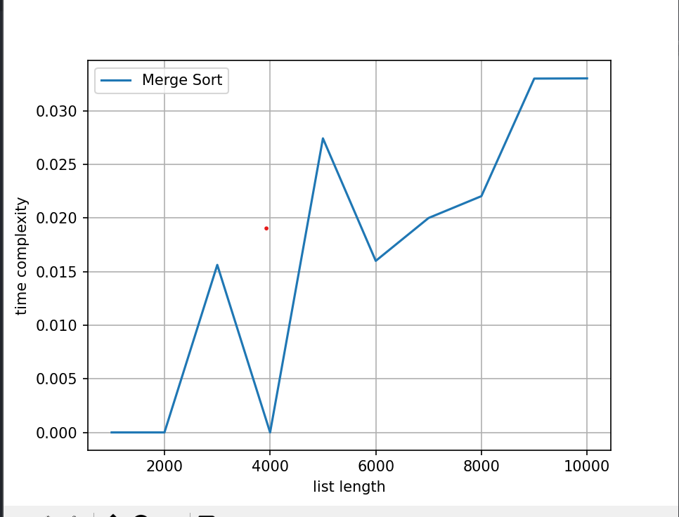

### Output :

1.Merge sort 2. Quick sort 3. Selection sort

Enter the choice:1

Enter the number of tv channels: 5

enter the number of viewers: 
100
200
500
300
400

Sorted array is:
 [100, 200, 300, 400, 500]

-----------------Running time analysis------------------

1000 elements sorted by Merge Sort 0.0

2000 elements sorted by Merge Sort 0.0

3000 elements sorted by Merge Sort 0.015623807907104492

4000 elements sorted by Merge Sort 0.0

5000 elements sorted by Merge Sort 0.027423858642578125

6000 elements sorted by Merge Sort 0.01599907875061035

7000 elements sorted by Merge Sort 0.019999027252197266

8000 elements sorted by Merge Sort 0.022034883499145508

9000 elements sorted by Merge Sort 0.03300023078918457

10000 elements sorted by Merge Sort 0.033017

